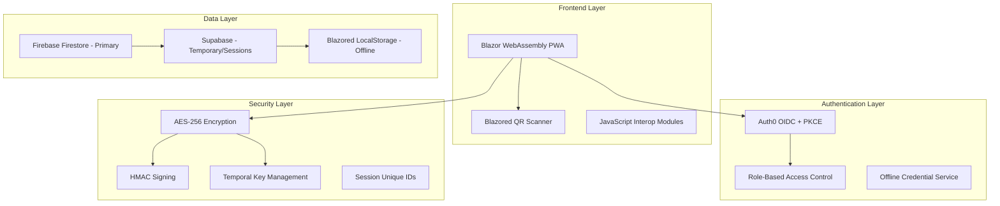
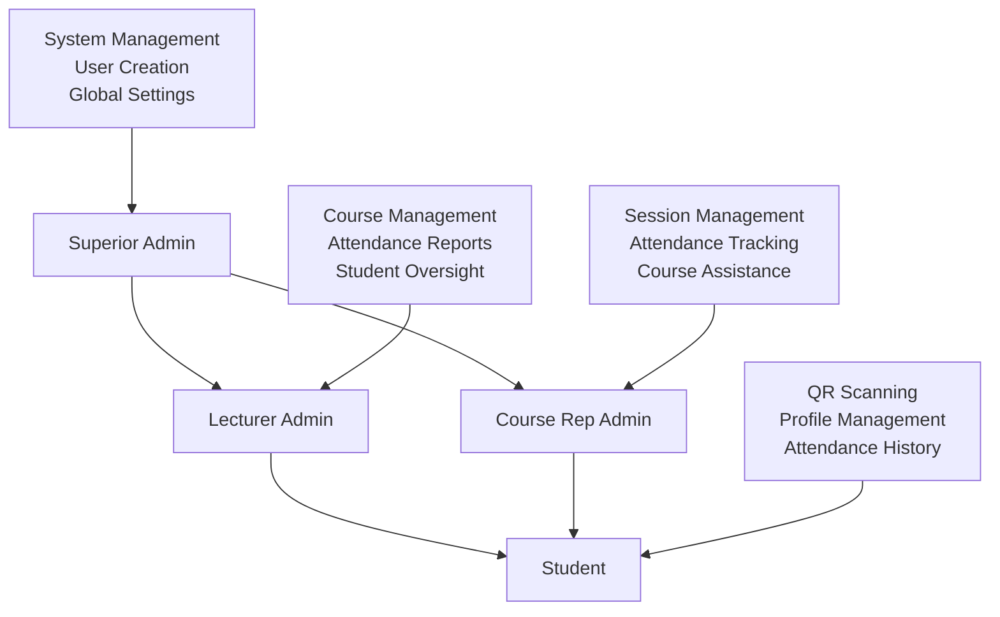

# AirCode - Secure Attendance Tracking System


**Enterprise-grade secure attendance tracking for higher education institutions**

[Live Demo](https://mid-d-man.github.io/AirCode/) • [Documentation](#documentation) • [Security](#security-features) • [Future Improvements](FutureImprovements.cs)

---

## 🎯 **Project Overview**

AirCode is a **cybersecurity-focused** Progressive Web Application (PWA) designed for secure attendance tracking in higher education institutions. Built with **Blazor WebAssembly**, it combines cutting-edge security protocols with seamless offline/online functionality to ensure data integrity and prevent attendance fraud.

> **⚠️ Development Status**: This application is actively under development. While most core features are complete, some pages may have incomplete logic implementation. Please check [FutureImprovements.cs](FutureImprovements.cs) for planned enhancements and current limitations.

### 🌟 **Key Highlights**

- 🔐 **Zero-Trust Security Model** with multi-layered authentication
- 📱 **Progressive Web App** with native mobile experience
- 🔄 **Hybrid Offline/Online** operation with automatic synchronization
- 🎫 **Cryptographically Secure QR Codes** with temporal validation
- 👥 **Role-Based Access Control** (RBAC) with hierarchical permissions
- 🌐 **Real-time Data Synchronization** across all devices

---

## 🏗️ **Architecture & Technology Stack**

<div align="center">



</div>

### 🛠️ **Core Technologies**

| Layer | Technology | Purpose |
|-------|------------|---------|
| **Frontend** | Blazor WebAssembly | Cross-platform UI framework |
| **Scanner** | Blazored QR Scanner | JavaScript-wrapped QR code scanning |
| **Authentication** | Auth0 OIDC + PKCE | Enterprise identity management |
| **Primary Database** | Firebase Firestore | Real-time data synchronization |
| **Secondary Database** | Supabase | Session management & edge functions |
| **Cryptography** | AES-256 + HMAC | Data encryption & integrity |
| **Offline Storage** | Blazored LocalStorage | Encrypted local data persistence |

---

## 🛡️ **Security Features**

### 🔐 **Multi-Layered Authentication**

- **Auth0 Integration**: Enterprise-grade OIDC with PKCE flow
- **Pre-authorized Users Only**: Skeleton user validation before account creation
- **Role-Based Access Control**: Hierarchical permission system
- **Offline Authentication**: Secure credential caching with encryption

### 🎫 **Cryptographically Secure QR Codes**

```
🔄 QR Code Generation Process:
1. Generate temporal cryptographic keys
2. Create session-unique identifier
3. Encrypt attendance data (AES-256)
4. Sign with HMAC for integrity
5. Embed temporal validation
6. Generate tamper-proof QR code
```

### 🔒 **Data Protection**

- **AES-256 Encryption**: All sensitive data encrypted at rest and in transit
- **HMAC Signatures**: Cryptographic integrity verification
- **Temporal Keys**: Time-bound encryption keys for session security
- **Zero-Knowledge Architecture**: Minimal data exposure principle

### 🛡️ **Attack Prevention**

| Attack Vector | Protection Mechanism |
|---------------|---------------------|
| **QR Code Forgery** | Cryptographic signatures + temporal validation |
| **Replay Attacks** | Session-unique IDs + time-based validation |
| **Data Tampering** | HMAC integrity checks + immutable records |
| **Unauthorized Access** | Multi-factor authentication + RBAC |
| **Offline Attacks** | Encrypted local storage + secure key derivation |

---

## 👥 **User Roles & Permissions**

<div align="center">



</div>

### 🎭 **Role Hierarchy**

1. **👑 Superior Admin**
   - Complete system administration
   - User account creation and management
   - Global configuration and security settings
   - System-wide reporting and analytics

2. **👨‍🏫 Lecturer Admin**
   - Course creation and management
   - Attendance session configuration
   - Student enrollment oversight
   - Academic reporting and analytics

3. **👨‍🎓 Course Rep Admin**
   - Attendance session management
   - QR code generation for sessions
   - Real-time attendance monitoring
   - Course-specific reporting

4. **🎓 Student**
   - QR code scanning for attendance
   - Personal attendance history
   - Profile management
   - Notification management

---

## 🚀 **Getting Started**

### 📋 **Prerequisites**

- .NET 7.0 SDK or later
- Auth0 account (free tier)
- Firebase account (free tier)
- Supabase account (free tier)

### ⚡ **Quick Setup**

1. **Clone the Repository**
```bash
git clone https://github.com/mid-d-man/AirCode.git
cd AirCode
```

2. **Install Dependencies**
```bash
dotnet restore
```

### 🔧 **Configuration Setup**

#### 1. **Auth0 Setup**

**Create Application:**
- Create a new Single Page Application in Auth0
- Configure callback URLs and CORS settings

**Create Roles:**
Create the following roles in Auth0:
- `SuperiorAdmin`
- `LecturerAdmin`
- `CourseRepAdmin`
- `Student`

**Configure Actions:**
You'll need to create Auth0 Actions for:
- **Pre-Registration**: Validates admin IDs and matriculation numbers against Firebase
- **Post-Login**: Assigns roles and adds role claims to JWT tokens

**Universal Login Customization:**
1. Go to Branding → Universal Login
2. Click on the warning (⚠️) icon
3. Edit the login HTML to collect:
   - **Students**: Matriculation number
   - **Course Reps**: Admin ID + matriculation number
   - **Lecturers**: Admin ID only
   - **Superior Admin**: Manually created in Auth0 with special admin ID

#### 2. **Firebase Setup**

**Firestore Configuration:**
- Create a new Firebase project
- Enable Firestore
- Update the Firebase configuration in `wwwroot/index.html`
- Review `wwwroot/js/firestoreModule.js` for implementation details

**Required Collections:**
Check the following locations for collection structures:
- `Services/Firebase/FirestoreService.cs`
- `Domain/Entities/` directory
- `Domain/ValueObjects/` directory

Key collections include:
- `VALID_ADMIN_DOCS`
- User management collections
- Course and session data

#### 3. **Supabase Setup**

**Database Tables:**
Create tables based on models in `Models/Supabase/` directory:
- `SupabaseAttendanceSession.cs`
- Additional models as referenced in the codebase

**Supabase Package:**
The project uses the Blazored Supabase package for WebAssembly.

#### 4. **Update Configuration**

Update `appsettings.json` with your service credentials:

```json
{
  "Auth0": {
    "Domain": "your-domain.auth0.com",
    "ClientId": "your-client-id",
    "Authority": "https://your-domain.auth0.com",
    "Audience": "your-api-audience"
  },
  "Supabase": {
    "Url": "your-supabase-url",
    "AnonKey": "your-anon-key"
  }
}
```

> **⚠️ Security Note**: The current configuration contains production keys that are restricted to authorized domains. Replace all credentials with your own service accounts.

### 🏃 **Run the Application**

```bash
dotnet run
```

---

## 📊 **Performance & Status**

> **🔧 Performance Optimization**: The application is currently undergoing performance optimization. Lighthouse scores and detailed metrics will be provided after completion of the performance enhancement phase.

**Current Status:**
- ✅ Core functionality implemented
- ✅ Security features operational
- ⚠️ Some page logic incomplete
- 🔧 Performance optimization in progress
- 🔧 UI/UX refinements ongoing

---

## 🗂️ **Project Structure**

For a complete overview of the project structure, see [ProjectStructure.txt](Others/ProjectStructure.txt).

```
AirCode/
├── 📁 Components/          # Reusable UI components
├── 📁 Domain/              # Business logic layer
├── 📁 Services/            # Application services
├── 📁 Pages/               # Application pages
├── 📁 Models/              # Data models and DTOs
├── 📁 wwwroot/             # Static assets
│   ├── js/                 # JavaScript modules
│   ├── css/                # Stylesheets
│   └── svgs/               # Application logos and icons
└── 📄 FutureImprovements.cs # Planned enhancements
```

---

## 🔮 **Future Development**

This project is actively evolving to become a comprehensive, easily adaptable attendance management system for higher education institutions. 

**📋 Planned Improvements:**
Please check the [FutureImprovements.cs](FutureImprovements.cs) file for detailed information about:
- Upcoming features
- Performance optimizations
- Security enhancements
- UI/UX improvements
- Scalability improvements

---

## 🤝 **Contributing**

We welcome contributions to improve AirCode's security, performance, and functionality. Please ensure you understand the current development status and check the Future Improvements file before contributing.

---

## 📝 **License**

This project is licensed under the MIT License - see the [LICENSE](LICENSE) file for details.

---

## 🙏 **Acknowledgments**

- **Auth0** for enterprise authentication solutions
- **Firebase** for real-time database capabilities
- **Supabase** for edge computing and session management
- **Blazored Community** for LocalStorage and QR scanning components
- **Blazor Team** for the WebAssembly framework

---

## 📞 **Support**

- 🐛 **Issues**: [GitHub Issues](https://github.com/mid-d-man/AirCode/issues)
- 📖 **Documentation**: Check individual service files for implementation details
- 🔧 **Setup Help**: Review the configuration sections above

---

<div align="center">

**Built for secure, scalable education technology**

[](https://github.com/mid-d-man/AirCode/stargazers)
[](https://github.com/mid-d-man/AirCode/network)
[](https://github.com/mid-d-man/AirCode/issues)

</div>
